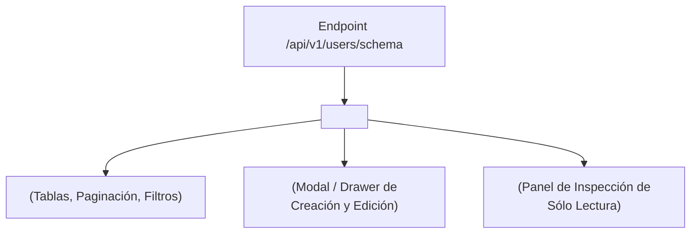

# Ecosistema Vuexy & Frontend Agnostic 💚

**SchemaBuilder** fue diseñado con una premisa clara: **el backend no debe depender de un frontend específico, y el frontend no debe acoplarse rígidamente al backend**.

Al emitir una especificación limpia y estandarizada en formato **JSON Schema**, cualquier librería de componentes moderna (Vue 3, React, Svelte o Blade con Alpine.js) puede consumir el esquema y renderizar la interfaz completa.

---

## 🎨 Integración con la Suite Dinámica de Vuexy / Vue 3

En la plantilla **Vuexy (Vue 3 + Vuetify + TypeScript)**, la integración con SchemaBuilder se realiza a través de tres componentes reutilizables:



---

## 💻 Implementación en una Vista de Vue 3 (`UsersView.vue`)

Gracias al endpoint `/schema`, crear una vista CRUD completa en Vuexy se reduce a **una sola línea de template**:

```vue
<!-- resources/js/pages/users/index.vue -->
<script setup lang="ts">
import CrudComponent from '@/components/crud/CrudComponent.vue';
</script>

<template>
  <CrudComponent 
    resource="/api/v1/users" 
    title="Directorio de Usuarios"
  />
</template>
```

### ¿Qué hace `<CrudComponent />` internamente?
1. **Paso 1**: Al montarse (`onMounted`), ejecuta `GET /api/v1/users/schema`.
2. **Paso 2**: Pasa `schema.table` a `<DynamicDataTable />`, configurando columnas, ordenamientos, botones de filtro y pestañas contextuales.
3. **Paso 3**: Al pulsar *"Nuevo Usuario"* o el botón de editar [✏️], abre el diálogo inyectando `schema.form` en `<DynamicForm />`.
4. **Paso 4**: Al presionar *"Guardar"*, `<DynamicForm />` extrae únicamente los campos editados (*Dirty Tracking*) y los envía mediante `POST` o `PATCH`.
5. **Paso 5**: Si el usuario pulsa [👁], abre el panel lateral de detalle con `schema.detail`.

---

## 🛠️ Desglose de Componentes Atómicos

Si no deseas utilizar `<CrudComponent />` y prefieres maquetar tu propia pantalla personalizada, puedes usar los componentes atómicos:

### 1. Solo la Tabla Dinámica (`<DynamicDataTable />`)

```vue
<script setup lang="ts">
import { ref, onMounted } from 'vue';
import DynamicDataTable from '@/components/crud/DynamicDataTable.vue';
import axios from 'axios';

const tableSchema = ref(null);
const users = ref([]);
const loading = ref(true);

onMounted(async () => {
  const { data } = await axios.get('/api/v1/users/schema');
  tableSchema.value = data.table;
  
  const res = await axios.get('/api/v1/users');
  users.value = res.data;
  loading.value = false;
});
</script>

<template>
  <DynamicDataTable 
    v-if="tableSchema"
    :schema="tableSchema"
    :items="users.data"
    :total-items="users.total"
    :loading="loading"
  />
</template>
```

---

### 2. Solo el Formulario Dinámico (`<DynamicForm />`)

```vue
<script setup lang="ts">
import { ref, onMounted } from 'vue';
import DynamicForm from '@/components/crud/DynamicForm.vue';
import axios from 'axios';

const formSchema = ref(null);
const formData = ref({});

onMounted(async () => {
  const { data } = await axios.get('/api/v1/users/schema');
  formSchema.value = data.form;
});

const handleSubmit = async (payload: any) => {
  await axios.post(formSchema.value.endpoint, payload);
};
</script>

<template>
  <DynamicForm 
    v-if="formSchema"
    :schema="formSchema"
    v-model="formData"
    @submit="handleSubmit"
  />
</template>
```

---

## 🌐 Arquitectura 100% Frontend Agnostic

¿Tu proyecto utiliza **React**, **Next.js**, **Inertia.js** o **Angular**?

SchemaBuilder emite exclusivamente **JSON estándar**. No hay plantillas Blade ocultas ni JavaScript inyectado en el servidor:

```json
{
  "table": {
    "columns": [
      { "key": "name", "label": "Nombre", "type": "text", "sortable": true }
    ]
  },
  "form": {
    "inputs": [
      { "name": "name", "label": "Nombre", "type": "text", "cols": 12, "md": 6 }
    ]
  }
}
```

Puedes escribir un renderer en React con Material-UI, Tailwind UI o Shadcn UI en menos de 200 líneas de código consumiendo la misma API de Laravel.
